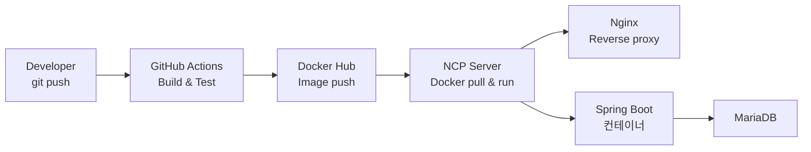

# 🍧 Taste Lab : Back-End Repository

- 편의점, 프렌차이즈 음식점 등 **음식 커스텀 꿀조합을 추천해주는 서비스**

---

## 💻 Development Environment

| Composition              | Use                  |
|:-------------------------|:---------------------|
| Project/Issue Management | `Notion`             |
| Knowledge Base           | `Notion`             |
| Source Management        | `GitHub`             |
| IDE / Editor Tools       | `IntelliJ` `dbeaver` |
| Deployment Management    | `GitHub Action`      |

## ⚙️ Tech Stack

| Composition | Use                                                          |
|:------------|:-------------------------------------------------------------|
| API         | `Java11` `SpringBoot`  `SpringSecurity` `JPA` `QueryDSL` |
| DataBase    | `mariaDB`                                                    |
| Build       | `Maven`                                                      |
| Infra       | `Nginx` `NCP` `Docker`                                       |                                       |

---

## 🔗 CI / CD 구성도

---

## 📌 주요 기능

- 상품 API (CRUD)

---

## 📎 Link

- [Front Repository](https://github.com/SeoYeonii/yumyum24)
